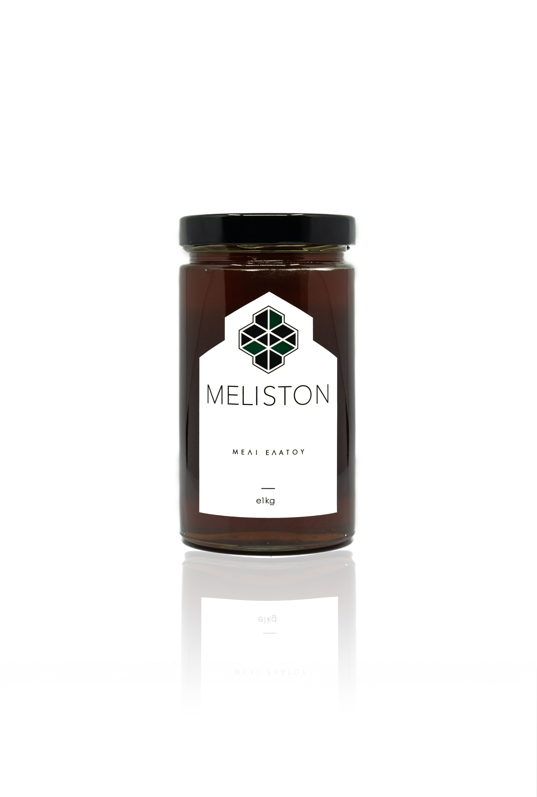
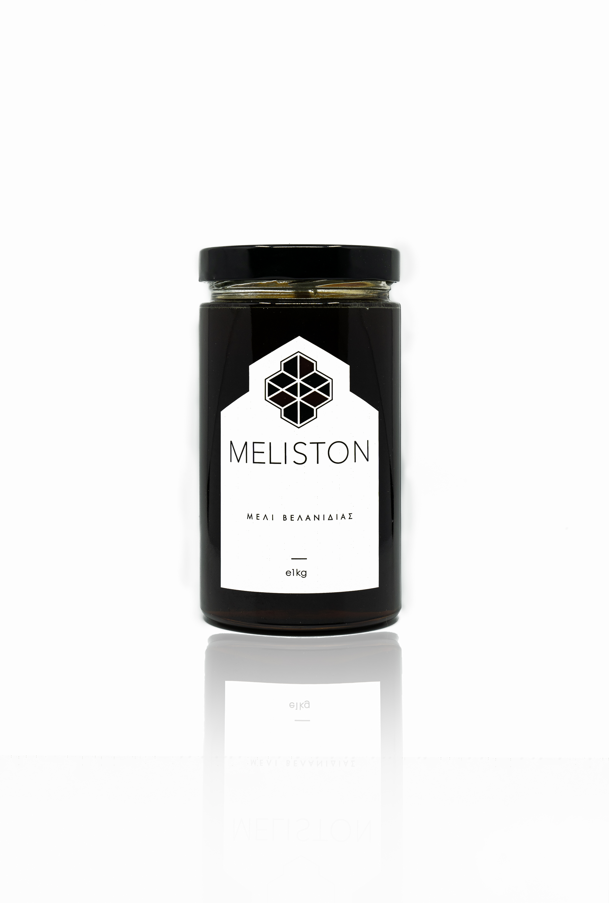

<!DOCTYPE html>
<html lang="el">
<head>
    <meta charset="UTF-8">
    <meta name="viewport" content="width=device-width, initial-scale=1.0">
    <title>Προϊόντα - Μέλια και Προϊόντα Μέλισσας</title>
</head>
<body>

<!-- Μπάρα πλοήγησης -->
<nav>
    <ul>
        <li><a href="index.html">Αρχική</a></li>
        <li><a href="products.html">Προϊόντα</a></li>
        <li><a href="about.html">Βιογραφικό</a></li>
        <li><a href="contact.html">Επικοινωνία</a></li>
        <li><a href="articles.html">Άρθρα</a></li>
    </ul>
</nav>

<!-- Προϊόν 1 -->

    <h2>Μέλι Θυμαρίσιο Τήνου</h2>
    
    
Περιγραφή: Το μέλι θυμαρίσιο τήνου είναι ένα αρωματικό και νόστιμο μέλι που παράγεται από τα άνθη του θυμαριού στο νησί της Τήνου.

<!-- Προϊόν 2 -->

    <h2>Μέλι Ερείκης Τήνου</h2>
    
    
Περιγραφή: Το μέλι ερείκης τήνου είναι ένα γλυκό και πλούσιο μέλι που παράγεται από τα άνθη της ερείκης στο νησί της Τήνου.

<!-- Προϊόν 3 -->

    <h2>Μέλι Ελάτου</h2>
    
    
Περιγραφή: Το μέλι ελάτου είναι ένα ιδιαίτερα αρωματικό μέλι που παράγεται από τα άνθη των ελάτων σε περιοχές με πυκνά δάση ελάτης.

<!-- Προϊόν 4, κ.λπ. -->

    <h2>Μέλι Βελανιδιάς</h2>
    
    
Περιγραφή: Το μέλι ελάτου είναι ένα ιδιαίτερα αρωματικό μέλι που παράγεται από τα άνθη των ελάτων σε περιοχές με πυκνά δάση ελάτης.

</body>
</html>
# products
